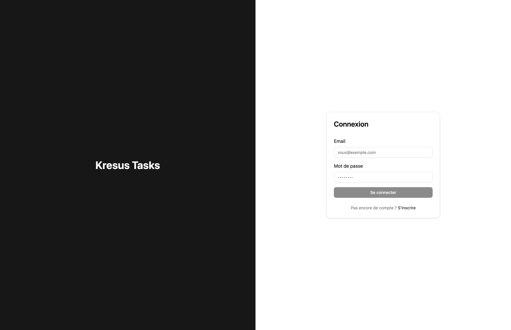
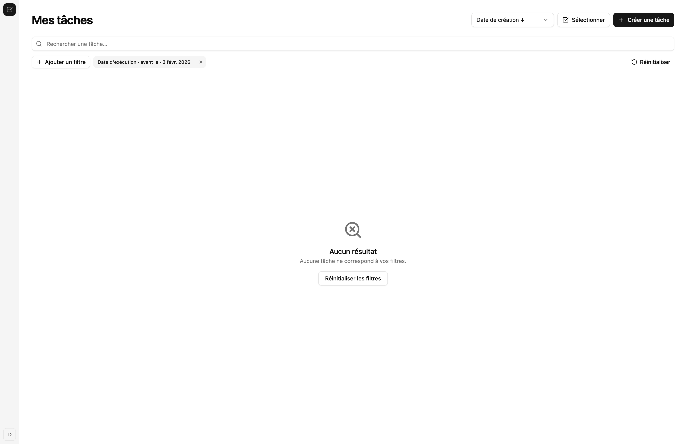
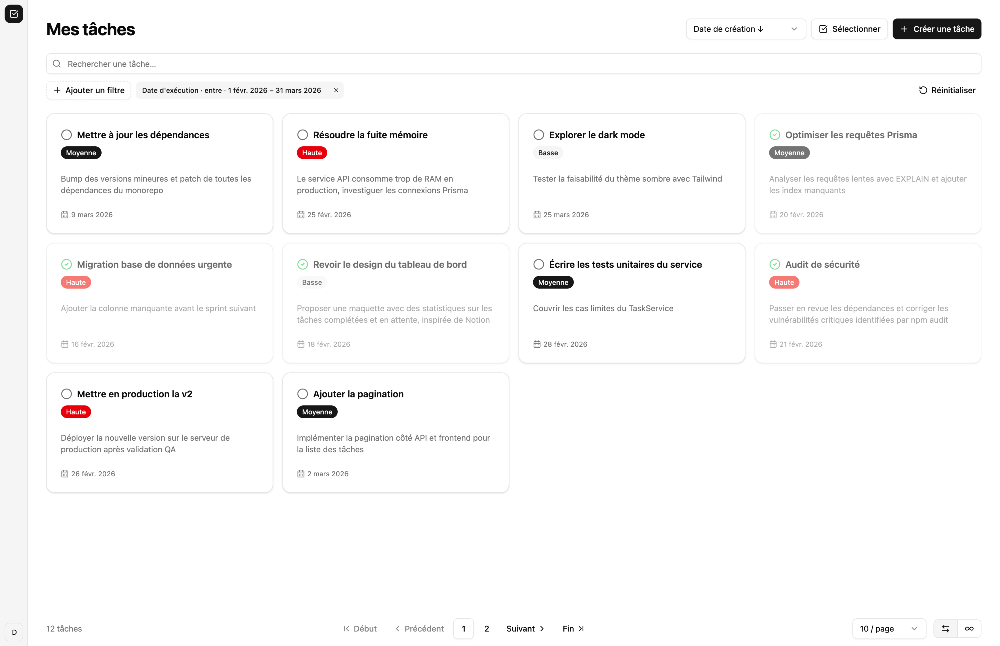
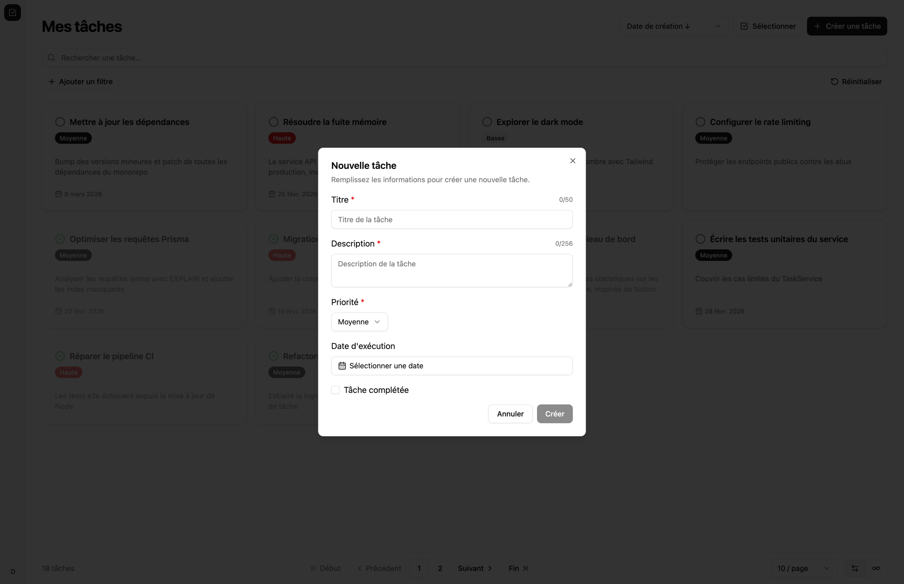
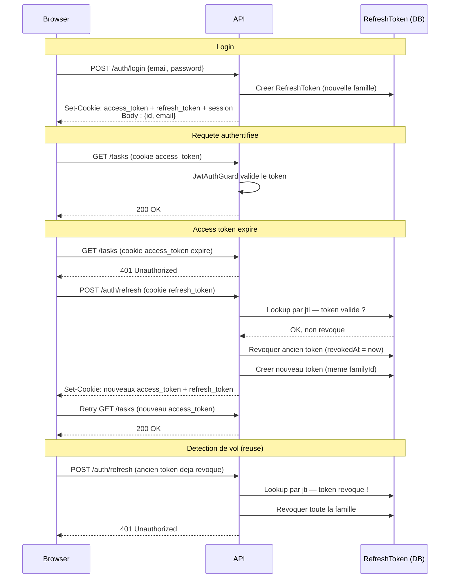

# Task App

Application de gestion de taches. Monorepo Turborepo avec une API NestJS et un frontend Vue 3.

## Prerequis

- Node.js >= 20.19.0 ou >= 22.12.0
- pnpm 10
- Docker (pour PostgreSQL)

## Installation

```bash
pnpm install
```

Copier le fichier d'environnement :

```bash
cp .env.example .env
```

## Demarrage

Lancer la base de donnees :

```bash
pnpm docker:up
```

Appliquer les migrations et seeder la base :

```bash
pnpm --filter=api migrate
pnpm --filter=api seed
```

Lancer l'application :

```bash
pnpm dev
```

L'API demarre sur http://localhost:3000 et le frontend sur http://localhost:5173.

La documentation Swagger est disponible sur http://localhost:3000/api.

## Compte de test

Le seed cree un utilisateur de test :

- Email : `dev@kresus.com`
- Mot de passe : `password123`

## Commandes utiles

| Commande | Description |
|----------|-------------|
| `pnpm dev` | Lancer API + frontend |
| `pnpm build` | Build de production |
| `pnpm test` | Lancer les tests |
| `pnpm lint` | Verifier le code |
| `pnpm format` | Formater le code |
| `pnpm --filter=api migrate` | Appliquer les migrations |
| `pnpm --filter=api migrate:reset` | Reset la base + migrations |
| `pnpm --filter=api seed` | Seeder la base |
| `pnpm --filter=api studio` | Ouvrir Prisma Studio |

## Structure

```
apps/
  api/         NestJS + Prisma
  web/         Vue 3 + TanStack Query
packages/
  contract/    Types, DTOs et schemas Zod partages
```

## Apercu

### Login



### Page des taches (empty state)



### Page des taches



### Creation de tache



## Architecture d'authentification

L'authentification repose sur un systeme de **dual-token en cookies httpOnly** avec rotation des refresh tokens et detection de vol.

### Flux d'authentification



### Token families

Chaque login cree une **famille de tokens** independante. Cela permet :
- **Multi-appareils** : chaque appareil a sa propre famille, un logout sur l'un n'affecte pas l'autre
- **Detection de vol** : si un token revoque est rejoue, toute la famille est invalidee
- **Logout cible** : seule la famille de la session courante est revoquee
